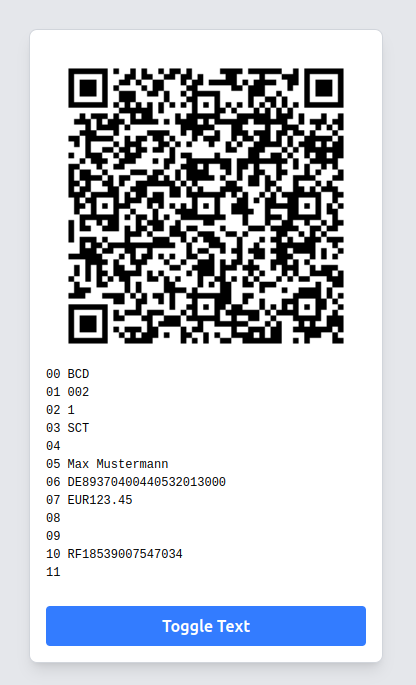

# European Payment Code





## Usage

Copy the file ```EuropeanPaymentCodeRenderer.vue``` into your project and use it as shown below.

```javascript
<div style="width: 320px">
    <EuropeanPaymentCodeRenderer :code="{
        iban: 'DE89370400440532013000',
        name: 'Max Mustermann',
        amount: 123.45,
        text: 'RF18539007547034'
    }" />
</div>
```

## Source

[GitHub Repository](https://github.com/srutz/vuepaymentcode)

License is WTFPL

